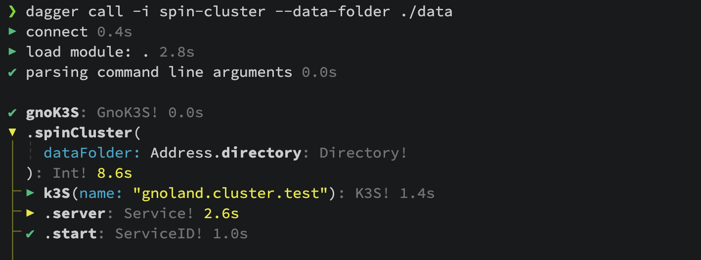
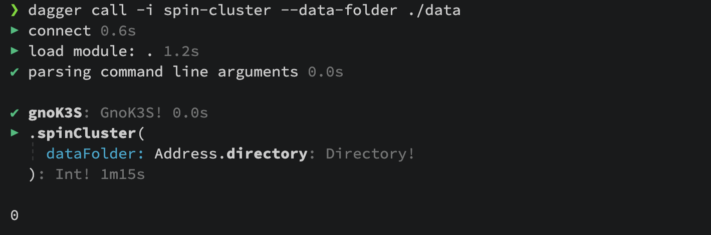

# Dagger

## What is Dagger

Dagger is a Pipeline As a Code tool that makes it possible to create fully reproducible and portable
workflows. These workflows can be:

- defined in any language enabled by Dagger SDKs (Golang, Typescript, Python)
- run and called seamlessly and consistently from a local machine or in a remote CI
  - using the exact same codebase
  - giving the same expected output in any environment by providing the same input

One of the advantages of Dagger is the possibility of rewriting a Github Action workflow in any of the available languages and fully testing it locally. The Github Action workflow itself will be then replaced by a simple call to a `function` in a `Dagger module` (See [Dagger core concepts](https://docs.dagger.io/core-concepts)).

## How we use Dagger in Gnoland

In [Gno.land](https://gno.land/) we use Dagger to consistently build and test different tools (like `gnokey`) or to build and publish on Netlify [documentation](https://docs.gno.land/).
Since Gno.land is written in Go, we were able to massively reuse the internal skills and knowledge with the [Dagger Golang SDK](https://pkg.go.dev/dagger.io/dagger).

- some workflows were written from scratch using Dagger Golang SDK
- other workflows were transformed from a Github Actions workflows into a Dagger module, where `GH Action runs` are replaced by calls to `Dagger functions` (See [CI/CD integration](https://docs.dagger.io/getting-started/ci-integrations/github-actions))

However, as Lead DevOps, one of the most interesting use cases of Dagger has been the possibility to test a whole Kubernetes cluster deployment and run with a single Dagger module.
This allows achieving multiple goals:

- test the infra consistency across multiple updates of the infra Git repository
- detect issues related to the Gno.land Docker image and its self-contained binary
- leverage the outcome of the Dagger functions as GitOps-like gateway procedures for updating test and staging infra environments

## Testing a full cluster deployment and run with Dagger

Requirements:

- Docker Daemon or other container runtimes
- [Dagger CLI](https://docs.dagger.io/getting-started/installation/#stable-release)
- Go SDK - it will be used to actually code the Dagger module

### Bootstrapping a Kubernetes Cluster

After bootstrapping the module with

```sh
dagger init --sdk=go kube-test
```

What we need is a way to bootstrap a Kubernetes Cluster itself.
Being in a docker-like environment the best option is a Kubernetes in Docker solution,
such as [KinD](https://kind.sigs.k8s.io/) or [K3s](https://k3s.io/).
Both are available in Daggerverse and can be installed as external module to be reused.

For sake of simplicity, K3s will be installed from Daggerverse and used.

```sh
dagger install github.com/marcosnils/daggerverse/k3s@v0.1.10
```

Here is the snippet to bootstrap K3s:

```go
// initialize K3s cluster
k3s := dag.K3S(ClusterName)
kServer := k3s.Server()
_, err := kServer.Start(ctx)
```

After having a cluster available the next step is allowing the usage of `Helm`. It will be useful to install nodes from the Helm template.

Let's take the chance to explain a little bit about Dagger. Dagger borrows the philosophy behind container building, it stacks progressive layers, caching each of them to avoid rebuilding a layer each time when there is no need.
That is exactly what will happen here:

- add the `Helm layer` into the Dagger function
- use a base image `alpine/helm` and `kubectl` package will be added as well
- reference `kubeconfig` to the corresponding K3s config

```go
m.initContainer = dag.Container().From("alpine/helm").
  WithoutEntrypoint().
  WithExec([]string{"apk", "add", "kubectl"}).
  WithEnvVariable("KUBECONFIG", "/.kube/config").
  WithFile("/.kube/config", k3s.Config(), defaultFileOwner).
  WithUser("1001").
```

### Running a validator node

It is now time to run a validator node. First of all, a genesis file is needed, but in order
to make it more realistic, this genesis file will be generated and then distributed using a URL endpoint.
This will allow reusing the Helm template which expects a URL to retrieve the genesis file.

```go
m.initContainer = m.initContainer.
  WithDirectory("/opt/data/genesis-server", m.manifestsFolder.Directory("genesis-server"), defaultDirOwner).
  WithFile("/opt/data/genesis.json", m.genesisFile, defaultFileOwner).
  WithFile("/opt/data/kustomization.yaml", m.manifestsFolder.File("gno-secret/kustomization.yaml"), defaultFileOwner).
  WithDirectory("/opt/data/helm", helmFolder, defaultDirOwner). // Helm template for Validator
  WithFile("/opt/data/template-values.yaml", helmDataFolder.File("template-values.yaml"), defaultFileOwner).
  WithWorkdir("/opt/data").
  WithExec([]string{"kubectl", "apply", "-k", "genesis-server/"}).
  WithExec([]string{"kubectl", "wait", "--for=condition=ready", "--timeout=30s", "pod", "-l", "app=genesis-file-server", "-n", "gno"}).
  WithExec([]string{"kubectl", "cp", "/opt/data/genesis.json", "gno/genesis-file-server:/usr/share/nginx/html/genesis.json"})
```

The snippet above gives us the opportunity to explore key features of Dagger.

#### Files and Directories

Similarly to OCI containers and Dockerfiles, Dagger will mount provided files and directories into specific layers.

- a folder or file mapping is provided when calling the function, indeed the referenced item is part of the arguments of the function itself

```go
func (m *GnoK3s) SpinCluster(ctx context.Context, dataFolder *dagger.Directory,) (int, error) {}
```

- the referenced argument can be _navigated_ and referenced any time from within the code

```go
helmFolder := dataFolder.Directory("helm")
helmDataFolder := dataFolder.Directory("values")
m.manifestsFolder = dataFolder.Directory("manifests")
```

- folders and files can then be _mounted_ into a layer

```go
WithDirectory("/opt/data/genesis-server", m.manifestsFolder.Directory("genesis-server"), defaultDirOwner)
```

will mount the folder `genesis-server`, as referenced above, into the container path `/opt/data/genesis-server`, same happens with single files

```go
WithFile("/opt/data/kustomization.yaml", m.manifestsFolder.File("gno-secret/kustomization.yaml"), defaultFileOwner).
```

#### Multi layer system

`dagger.Container` will stack more and more layers, either they contain a mount or the execution of a command, but any subsequent layer will be able to access a previous layer. This means that

- a command can reference any folder or file mounted in a previous layer
- the result of a command in a previous layer can be reused ahead
- the new layer is fully aware of the context of the previous layers in terms of file, folder, running services

These features are the key to achieve a testable cluster: each layer will be deploying its own resources into the Kubernetes cluster represented by another `dagger.Container`.

#### Deploying a validator node

Deploying a validator node will require the following steps:

- generating validator's secrets
- adding above generated secrets to the valset in the genesis file
- reference a config file
- spin the validator node from a Helm template

The first two steps are performed in a dedicated method which generates secrets and adds them to the genesis file, the latter will then be served by `geneses-server`. When testing more complex topologies multiple validators can be added either

```go
// Generates secrets for validator and add them to genesis
func (m *GnoK3s) setupValidatorNodes(ctx context.Context, valCounter int) []networkNode {
  validators := []networkNode{}
  for i := range valCounter {
    nodeName := fmt.Sprintf("gnocore-val-%02d", i+1)
    // Secrets dir
    gnoSecretsDir := m.generateSecrets()
    // Genesis file
    m.genesisFile = m.addValidatorToGenesis(nodeName, gnoSecretsDir)
    validators = append(validators, networkNode{
      name:          nodeName,
      nodeAddress:   getNodeAddress(ctx, nodeName, gnoSecretsDir),
      secretsFolder: gnoSecretsDir,
    })
  }
  return validators
}
```

All the useful information on a validator is stored into a dedicated data type

```go
type networkNode struct {
  name            string
  nodeAddress     string // node p2p address
  secretsFolder   *dagger.Directory
  configOverrides map[string]string
}
```

At this point running the validator is just a matter of deploying the Helm release, referencing:

- config file, provided from the argument root folder, see [above](#files-and-directories)
- secrets, generated in the step above
- genesis url, passed as value to the Helm release and referencing the `genesis-server`

```go
// Spins a network node that can be either a validator, sentry or rpc node
func (m *GnoK3s) spinNetworkNode(valName string, valNode networkNode, helmDataFolder *dagger.Directory) *dagger.Container {
  homeFolder := fmt.Sprintf("/opt/data/%s", valName)
  return m.initContainer.
    WithFile(fmt.Sprintf("%s/config/config.toml", homeFolder), helmDataFolder.File("config/config.toml"), defaultFileOwner).
    WithDirectory(fmt.Sprintf("%s/gno-secrets", homeFolder), valNode.secretsFolder, defaultDirOwner).
    // replace config map name
    WithExec([]string{"sh", "-c", fmt.Sprintf("sed -e 's/gnocore-val-01/%s/' /opt/data/kustomization.yaml > %s/kustomization.yaml", valName, homeFolder)}).
    WithExec([]string{"kubectl", "apply", "-k", homeFolder}).
    // replace helm values for template
    WithExec([]string{"sh", "-c", fmt.Sprintf("sed -e 's/gnocore-val-01/%s/' /opt/data/template-values.yaml > %s/values.yaml", valName, homeFolder)}).
    WithExec(slices.Concat([]string{"helm", "install", valName, "/opt/data/helm", "--values", fmt.Sprintf("%s/values.yaml", homeFolder),
      "--set", "global.genesisUrl=http://genesis-svc/genesis.json"}, valNode.GetOverridesHelm())).
    WithExec([]string{"kubectl", "wait", "--for=condition=ready", "--timeout=60s", "pod", "-l", fmt.Sprintf("gno.name=%s", valName), "-n", "gno"})
}
```

Here there is a small trick that will be repeatedly leveraged along all the code. When deploying resources via `kubectl`, the command itself will just return without waiting for the pod to be effectively ready, therefore an explicit way to test that the pod is ready is needed, nothing fancy, just reusing `kubectl` powers.

```go
.WithExec([]string{"kubectl", "wait", "--for=condition=ready", "--timeout=60s", "pod", "-l", fmt.Sprintf("gno.name=%s", valName), "-n", "gno"})
```

If this layer fails, the whole `dagger.Container` will exit with an error and block the execution.
Note that as in a real scenario, this can happen for any reason: missing files or data, wrong parameters provided, or the most interesting one, an issue in the `gnoland` container itself within the Pod.

### Running a non-validator node and testing against an RPC endpoint

The method above can be reused to spin any kind of network node in the cluster, either a validator or a non-validator node, such as an RPC node.
The latter node is quite straightforward to spin, the node will

- generate secrets
- reuse the genesis endpoint (but it won't be added to the validators set)
- expose the RPC interface on port 26657, by editing the config file (by default RPC interface is not exposed publicly)

The container layers added at this point are the same as in any other validator node, reusing the `spinNetworkNode` method. But in this case having an RPC interface exposed allows testing just using `curl` from another layer, by also adding some tolerations using `--retry` and `--retry-delay` parameters.

```go
return testableContainer.
  WithExec([]string{"curl", "-fsS", "--retry", "5", "--retry-delay", "10", "--retry-all-errors", fmt.Sprintf("http://%s%s", svcUrl, testPath)}).
  ExitCode(ctx)
```

Here there is a caveat, since we are in a very minimalistic environment, the most straightforward way to expose a Kubernetes service is using `NodePort`. However this means that the port exposed by the service itself is mapped into a random port of the Kubernetes node.
For this reason, a tiny method queries `kubectl` for the current node port and once found returns the `k3s` endpoint having this exact port, making the service fully discoverable when using `curl`.

```go
func (m *GnoK3s) GetSvcExposedEndpoint(
  ctx context.Context,
  testableContainer *dagger.Container,
  serviceName string,
  servicePort int) (string, error) {
  svcPort, err := testableContainer.
    WithExec(strings.Split("kubectl get svc -n gno "+
      serviceName+
      " -o jsonpath='{.spec.ports[?(@.port=="+
      fmt.Sprintf("%d", servicePort)+
      ")].nodePort}'", " ")).
    Stdout(ctx)
  if err != nil {
    return "", err
  }
  svcPort = strings.ReplaceAll(svcPort, "'", "")
  return strings.ReplaceAll(m.k3sEndpoint, fmt.Sprintf("%d", K3sKubePort), svcPort), nil
}
```

### Running ecosystem services

The same approach as above, _deploy and endpoint test_, can be used with other services in the ecosystem, such as `Gnoweb`.
The method will get manifests and deploy them using `kubectl` and `kustomize`.

```go
func (m *GnoK3s) spinGnoservice(
  ctx context.Context,
  serviceName string,
  serviceDirname string,
) *dagger.Container {
  // Gnoweb
  k8sHelmKeyFiles := m.manifestsFolder.Directory(serviceDirname).Filter(dagger.DirectoryFilterOpts{
    Include: []string{"*/*yaml"},
    Exclude: []string{"ingress/*"},
  })
  filterdEntries, _ := k8sHelmKeyFiles.Entries(ctx)

  gnoserviceContainer := m.initContainer
  var kubectlFlag string
  filePaths := getFiles(ctx, k8sHelmKeyFiles, filterdEntries)

  // deploy resources
  for _, path := range filePaths {
    deployPath := path
    if strings.Contains(path, "kustomization.yaml") {
      kubectlFlag = "-k"
      deployPath = strings.ReplaceAll(path, "kustomization.yaml", "")
    } else {
      kubectlFlag = "-f"
    }
    gnoserviceContainer = gnoserviceContainer.
      WithFile("/opt/data/"+path, k8sHelmKeyFiles.File(path), defaultFileOwner).
      WithWorkdir("/opt/data").
      WithExec([]string{"kubectl", "apply", kubectlFlag, deployPath})
  }
  // path service to make it testable
  return gnoserviceContainer.WithExec([]string{"kubectl", "patch",
    "service", serviceName,
    "-n", "gno",
    "-p", "{\"spec\":{\"type\":\"LoadBalancer\"}}"})
}
```

It will be tested as it was the RPC node:

- extracting service _real_ address, by retrieving service node port to be replaced into the `K3s endpoint`
- testing the resulting endpoint against `curl` command

## Putting all together

### Calling a Dagger command

After all these steps the full cluster environment is definitely ready to be launched, deployed and tested.
All of the magic will happen into a single command using `Dagger CLI` and referencing a local folder as argument.

```sh
dagger call spin-cluster --data-folder ./data
```

### Getting results and debugging errors



When everything goes well, everyone gets excited. Actually in this specific case nothing special will happen,
the command will just `return exitCode, err`, so it prints and returns the 0 exit code.



However often things go in an unexpected direction and discovering what is wrong is not easy.
Dagger CLI provides a useful feature which can be activated adding the `-i` flag,

```sh
-i, --interactive                  Spawn a terminal on container exec failure
```

This will land you directly into the failing command, like you were doing an `exec` command into a Kubernetes pod or Docker container.
From there any command installed is available, for example you can easily explore pods and their logs

```sh
/opt/data $ kubectl get pod -n gno
/opt/data $ kubectl logs -n gno -f gnocore-val-01-
```

## Calling into a Github Actions

Here comes the real power of Dagger!

Forget swearing against your failing pipeline in Github Actions, or any other native CI/CD. As explained [above](#what-is-dagger), Dagger can replicate the same behaviour tested locally in a remote Github Actions workflow and this is totally seamless. It is just a matter of making the same local `Dagger CLI` call into a Github workflow.

```yaml
kube_cluster:
  name: kube-cluster
  runs-on: ubuntu-latest
  steps:
    - name: Checkout
      uses: actions/checkout@v4
      with:
        fetch-depth: 0
    - name: Spin up cluster
      uses: dagger/dagger-for-github@v8.2.0
      with:
        version: "v0.19.6"
        module: daggerverse/k3s
        call: spin-cluster --data-folder daggerverse/k3s/data
```

## Future work

From this basic but powerful environment, multiple additional scenarios can be tested, like

- adding more nodes and topologies, such as sentry nodes or other multiple validators
- concatenating this Dagger function into other functions to create more complex use cases

## Conclusions

Dagger is a powerful and creative tool, it opens a lot of use cases, not only in the CI domain.
Eventually CI tasks can be tested seamlessly on local and remote hosts. The distances between Devs
and Ops can be shortened by having common reusable code in the most suitable language an organization employs.

All the code you have seen here can be found in the `k3s` module in my personal `Daggerverse` in this [Github repo](https://github.com/sw360cab/daggerverse). Feel free to use, test and fork it.

## References

- [Kubernetes Cluster Testing](https://github.com/sw360cab/daggerverse/tree/master/daggerverse/k3s)
- [Dagger Doc](https://docs.dagger.io)
- [Dagger Core Concepts](https://docs.dagger.io/core-concepts)
- [Dagger CI/CD Integration with GitHub Actions](https://docs.dagger.io/getting-started/ci-integrations/github-actions)
- [K3s module on Daggerverse](https://daggerverse.dev/mod/github.com/marcosnils/daggerverse/k3s)
